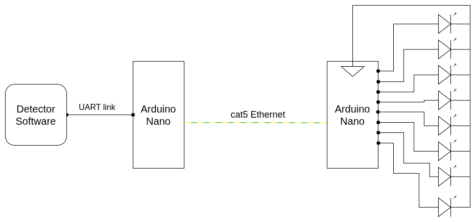

# Suppressor Driver Board

Arduino Nano firmware that switches up to 8 RF jammer modules on or off in response to serial commands forwarded from the host detector by the [bridge board](../suppressor_bridge_board/). Used as the proof-of-concept output stage for the [analog video suppressor](../README.md).

This board sits on the **far end** of the link, next to the jammer modules. It receives the channel bitmask from the bridge board over a single twisted pair lifted from a piece of Ethernet cable.

## Role in the system

```
HackRF One ──► detector.py ──► utils/jammer.py ──USB serial──► bridge board ──twisted pair──► driver board ──► 8× jammer modules
```

When the detector confirms an analog video transmission, [`utils/jammer.py`](../utils/jammer.py) maps the detected frequency to one of the bands declared in `config.toml [jammer].ranges`, computes the new channel bitmask, and writes a single byte over USB serial to the bridge board. The bridge board re-emits the byte on its `D2` software-UART pin; this driver board reads it on `D10` and mirrors the bitmask onto digital pins D2–D9.

## Hardware

- **MCU board**: Arduino Nano (ATmega328P, 5 V, 16 MHz)
- **Link in**: software UART **RX on D10**, 9600 baud, 8N1. Wired to the bridge board's `D2` over one conductor of an Ethernet twisted pair; ground is carried on the second conductor and tied to the cable's shield, common with the bridge-board side.
- **Channels**: 8, driven from digital pins **D2 (channel 1) … D9 (channel 8)**
- **Output level**: 5 V logic — each pin should drive a switching stage (transistor / MOSFET / SSR) sized for the module it powers. The Nano pins themselves are not wired directly to RF amplifiers.


### Pin map

| Channel | Nano pin | Default frequency band (`config.toml [jammer].ranges`) |
|---|---|---|
| 1 | D2 | 100–900 MHz   |
| 2 | D3 | 900–1600 MHz  |
| 3 | D4 | 1600–2400 MHz |
| 4 | D5 | 2400–3200 MHz |
| 5 | D6 | 3200–4000 MHz |
| 6 | D7 | 4000–4800 MHz |
| 7 | D8 | 4800–5600 MHz |
| 8 | D9 | 5600–6000 MHz |

The frequency assignments above are the defaults shipped in `config.toml`. Edit `[jammer].ranges` to match the actual modules you wire up.

## Serial protocol

- **Port settings**: 9600 baud, 8N1, software UART on **D10 (RX)**
- **Frame**: a single byte
- **Encoding**: each bit is one channel state — bit 0 = channel 1, bit 7 = channel 8. `1` turns the channel on, `0` turns it off.

The host re-sends the full state byte on every change; the board has no internal state machine. On power-up the firmware initialises every channel to off.

| Byte (binary) | Hex  | Channels on |
|---------------|------|-------------|
| `0000 0000`   | 0x00 | none (all off) |
| `0000 0001`   | 0x01 | 1 |
| `0000 1000`   | 0x08 | 4 |
| `1000 0001`   | 0x81 | 1 and 8 |
| `1111 1111`   | 0xFF | all |

For bench testing you can drive the board manually by writing to the bridge board's USB port — the bridge transparently forwards every byte onto the twisted pair:

```bash
# turn channel 1 on
printf '\x01' > /dev/ttyUSB0
# everything off
printf '\x00' > /dev/ttyUSB0
```

## Build and flash

The firmware is a standard PlatformIO project under [`suppressor_driver/`](suppressor_driver/).

```bash
cd suppressor_driver_board/suppressor_driver
pio run                # compile
pio run -t upload      # flash the connected Nano
pio device monitor     # serial monitor at 9600 baud
```

If `pio` is not installed: `pip install platformio`, or use the PlatformIO IDE extension in VS Code.

The target environment is defined in [`platformio.ini`](suppressor_driver/platformio.ini):

```ini
[env:nanoatmega328]
platform = atmelavr
board = nanoatmega328
framework = arduino
```

If your Nano uses the new bootloader, change `board = nanoatmega328new`.

## Connecting to the detector

In the project root [`config.toml`](../config.toml):

```toml
[jammer]
enabled       = true             # set to true to drive the board
port          = "/dev/ttyUSB0"   # the bridge board's USB port — check `dmesg` after plugging it in
baud          = 9600
modules       = 8
hold_seconds  = 60               # how long a channel stays on per detection
ranges = [
    { min = 100_000_000,   max = 900_000_000 },
    { min = 900_000_000,   max = 1_600_000_000 },
    # ...
]
```

Note that `port` points at the **bridge board** (PC end), not at this driver board — the driver has no USB connection of its own.

`hold_seconds` is the auto-off timeout; the channel re-arms (timer resets) every time the detector confirms a video signal in that band. While a channel is active, the scanner skips its frequency range to avoid the jammer's own emission feeding back into the detection pipeline.